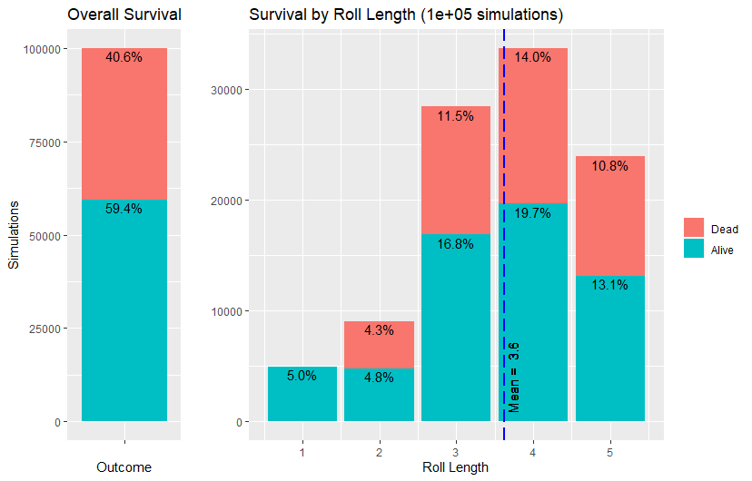

# DnD 5e Death Save Simulator

An implimentation in Python and R of Monte Carlo simulations for death saving throws in DnD 5e.

A death saving throw occurs when a character falls below 0 HP in game. On their turn at each round of combat they must roll a twenty sided die (d20) and record the result as either a success when the die is 10+ or else a failure. A roll of 20 counts as 3 successes where as a roll of 1 results in two failures. When a character reaches 3+ successes or failures they either live and come back to life unconscious at 0 HP or are dead forever.

Results from death_save_sim.R showing the overall survival rate and survival rate by roll length out of 100,000 rolls.
