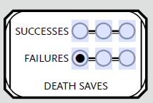

```{r setup, include=FALSE}
knitr::opts_chunk$set(echo = TRUE)
```

## Introduction

[Dungeons and Dragons](https://en.wikipedia.org/wiki/Dungeons_%26_Dragons) (D&D) is a tabletop roleplaying game originally developed in 1974 by Gary Gygax and Dave Arneson. Players assume the role of a player character, PC, and they play together to respond to the narrative concocted by the Dungeon Master, DM. This analysis will examine the probability of surviving when a PC's health points, HP, drops below 0.


### So what really is a death saving throw?

PC's have a certain amount of HP. When they take damage, their HP total drops. When their HP total drops below zero they go unconscious and have to make a death saving throw. Each saving throw boils down to rolling a 20 sided die on their turn to see if their character gets closer to stabilizing or dying forever.

### The Nitty Gritty Rules!

Each time a PC rolls the 20 sided die, d20, they note the outcome and either place a check in the corresponding "Successess" or "Failures" section (see Fig 1. below). If the roll is between 2 and 9 then they place one check in the "Failures" section. If the roll is between 10 and 19 then they place one check in the "Successess" section. What about a roll of 1 or 20? These numbers are special in D&D and are usually treated as an automatic failure or success respectively. In the context of death saving throws, rolling a 1 counts as placing two checks in the "Failures" section. Rolling a 20 results in placing three checks in the "Successess" section and your character immediately coming back to life with 1 HP.

Regardless, once three or more marks in either the "Failures" or "Successess" sections are reached your character either lives or dies respectively.




## What is the likelihood of living or dying?

So, as we can see from the rules above it is not a simple probability calculation to come up with our likelihood of either living or dying. Instead we are dealing with [conditional probability](https://en.wikipedia.org/wiki/Conditional_probability) and must use a more sophisticated means to derive the likelihood of surviving. In order to answer this I will implement a Monte Carlo simulation as well as a Markov chain Monte Carlo (MCMC) to perform thousands of death saving throw events and arrive at the approximate answer.


## Monte Carlo simulation

As a brief summary, a Monte Carlo simulation approximates a probabilistic outcome through a deterministic set of rules. There are generally four steps involved:

1. **Define the inputs:** In our case these are the outcomes from rolling the d20.

2. **Generate random inputs from a defined distribution:** Roll the d20.

3. **Compute an outcome from the inputs:** Did the PC live or die?

4. **Aggregate the results:** Plot and analyze the results to determine the probability of surviving.

First we will need a function that will perform a single death saving throw event, that is roll a d20 enough times to determine whether or not the PC survives.

```{r}
death_save <- function() {
  # Variables to track
  live <- 0
  die <- 0
  roll_length <- 0
  
  rolling <- T
  while (rolling == T) {
    # Roll the die, increment roll_length, and increment live or die accordingly
    roll <- sample(1:20, 1)
    roll_length <- roll_length + 1
    if (roll == 20) {
      live <- live + 3
    } else if (roll == 1) {
      die <- die + 2
    } else if (1 < roll & roll < 10) {
      die <- die + 1
    } else {
      live <- live + 1
    }
    
    # Check how many successes or failures there are and either keep rolling or not
    if (live >= 3) {
      rolling <- F
      result <- 1
    } else if (die >= 3) {
      rolling <- F
      result <- 0
    }
  }
  
  # Return both the result and how many rolls it took to get that result in a list
  return(list(result, roll_length))
}
```

This function will be run thousands of times, storing the results each time to analyze later. But first, let's build our MCMC to compare the runtimes between these two approaches.


## Markov chain Monte Carlo simulation

Ultimately we have two final states that a death saving throw event can end up in, success or failure. To get to these final states you can think about each roll as a walk through a graph of nodes, where every node represents the outcome of all previous rolls. We will always start with zero successes and zero failures, but after each roll we will randomly move to a new node in our graph. The shortest path we can take to a final state is rolling a 20 on our first roll. The longest path we can take would be five rolls, two successes and two failures before a final success or failure. So, this problem can be perfectly represented with whats known as a directed acyclic graph, [DAG](https://en.wikipedia.org/wiki/Directed_acyclic_graph). Below you can see such a DAG for this problem.

```{r}
library(tidyverse)
library(ggdag)

dagify(y ~ x) %>% 
  ggdag()
```


## Performing and Benchmarking Analysis

Next we will perform the actual Monte Carlo and MCMC simulations by conducting 10,000 of death saving throw events for each method, tracking their results and reporting the time it took to perform the analysis.

```{r}
options(digits = 2) # Report to 2 significant figures

# Conduct the Monte Carlo simulation
trials <- 10^5

ds_data <- replicate(trials, death_save())
ds_result <- unlist(ds_data[1,])
ds_roll_length <- unlist(ds_data[2,])

# Results
(mean_outcome <- mean(ds_result)) # Probability of surviving
(mean_roll <- mean(ds_roll_length)) # The average number or rolls in a death saving throw event
```

So, it looks like we have a roughly 60% chance of surviving a death saving throw event and an average death saving throw event takes between 3 and 4 rolls to determine. 


## Survival probability broken down by roll length

We can dig deeper into the results and graphically show the probability of survival not only overall but broken down by roll length.

```{r}
# Plot the results
library(ggplot2)
library(scales)
library(gridExtra)
df <- data.frame(rolls=ds_roll_length, results=ds_result, d_a=rep("", trials))

p <- ggplot(df, aes(d_a, fill=factor(results))) + 
  geom_bar() +
  geom_text(aes(label=scales::percent(..count../sum(..count..))), stat='count', position="stack", vjust=1.2) +
  theme(legend.position = "none") + labs(title = "Overall", x="Outcome", y="Simulations")

p2 <- ggplot(df, aes(rolls, fill=factor(results))) + geom_bar()  + 
  labs(title = paste("By Roll Length (",format(trials, scientific = T), " simulations)", sep=""), 
       x="Roll Length", y="") +
  theme(legend.title = element_blank()) + 
  scale_fill_discrete(labels=c("Dead", "Alive")) +
  geom_text(aes(label=scales::percent(..count../sum(..count..))), stat='count', position="stack", vjust=1.2) 

grid.arrange(p, p2, widths=c(1,3))
```

From the graph above we can see that you are most likely to roll more than 2 times before you either succeed or fail. This is important because death saving throws are usually performed while the PCs are in combat. Combat in D&D is turned based so this means that if a player "goes down" and is performing death saving throws each round, then the other PCs should immediately do their best on their turn to help that player (ie. heal or stabilize them with a medicine check) before their third death saving throw.